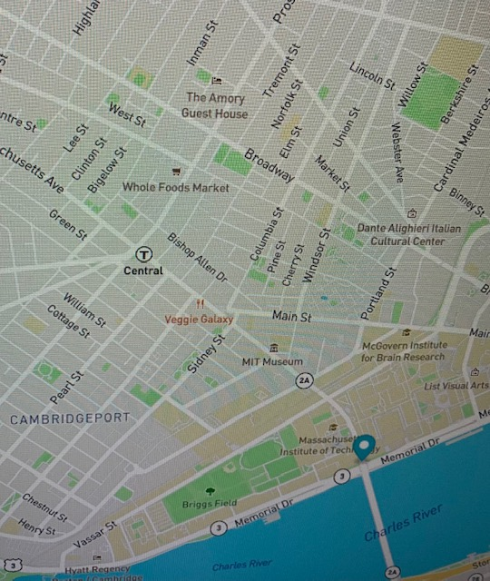

# Real-Time-Bus-Tracker
## This shows bus stop locations between MIT and Harvard.
### To run this project clone the repository to capture files on your machine.  You can drag the HTML document link onto a web browser and the page will load to display a map. Click on the 'Show stops between MIT and Harvard' button to see the tracker move to each bus stop location until reaching its destination. 
### License Info:  This project was created in participation of the MIT xPro Women's Coding Certificate Program. The MIT License applies to all files.

<a href="https://github.com/JadrianBG/JadrianBG.github.io"> Return to JadrianBG Repo Home Page </a> 

  
